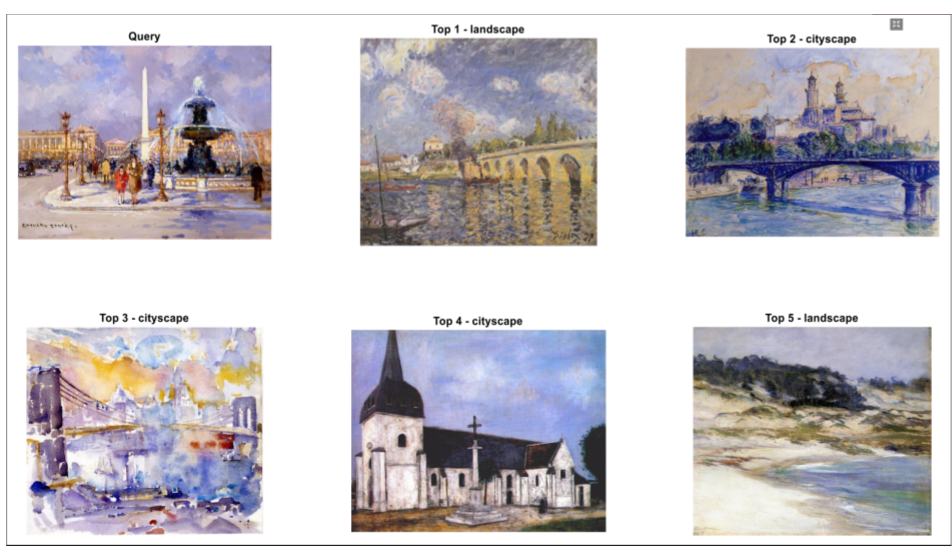

# Mobile-Based Painting Photo Retrieval using Combined Features
Idea of the project: To help art lovers find similar paintings based on mobile photoshoots of a random painting in a museums

Users of this code are encouraged to cite the following article: Companioni-Brito, C., Mariano-Calibjo, Z., Elawady, M., Yildirim, S. (2018). Mobile-Based Painting Photo Retrieval Using Combined Features. In: Campilho, A., Karray, F., ter Haar Romeny, B. (eds) Image Analysis and Recognition. ICIAR 2018. Lecture Notes in Computer Science(), vol 10882. Springer, Cham. https://doi.org/10.1007/978-3-319-93000-8_32

Input: mobile-based photo of an unknown painting
Output: similar famous paintings (Top-5) with respect to color and texture properties + tag info (i.e. artist name, title, year, style)

Dataset: https://www.kaggle.com/c/painter-by-numbers/ (+100,000)

Texture - GLCM, LBP
http://dismac.dii.unipg.it/ctc/code.html

Color - HSV Histogram
https://github.com/kirk86/ImageRetrieval

Shape - Image Signature Saliency algorithm + Ostu Binary Thresholding + Fourier Descriptor
http://www.vision.caltech.edu/~harel/share/gbvs.php
https://fr.mathworks.com/matlabcentral/fileexchange/52643-fd-=-gfd-bw-m-n--implementation-of-the-generic-fourier-descriptors

Hashing: LSH
http://www.mit.edu/~andoni/LSH/ (code)
https://arxiv.org/pdf/1706.06064.pdf (CBIR survey)

Framework:
Color Image (C) --> [Gray-Scale Conversion] --> Gray-scale Image (G)

(C) --> [Feature Extraction: HSV Histogram] --> Color Feature (fC)

(G) --> [Feature Extraction: GLCM] --> Texture Feature (fT1)
(G) --> [Feature Extraction: LBP] --> Texture Feature (fT2)

(C) --> [Visual Attention: Image Signature Saliency algorithm] --> Saliency Image in Gray-Scale (sG)
(sG) --> [Binary Conversion: Ostu Threhsolding] --> Salieny Image in Binary (sB)
(sB) --> [Feature Extraction: Fourier Descriptor (FD)] --> Shape Feature (fS)

(fC,fT1,fT2,fS) --> [Feature Fuse: Concatenation] --> All Features (fA)

(fA) --> [Image Ranking: Eucleaden Distance] --> Top 5 Similarity (S1)
(fA) --> [Image Hashing: LSH] --> Top 5 Similarity (S2)

Comments: S2 is faster than S1 but S1 is more accurate than S2 because S2 is an approximation through using hashing functions
